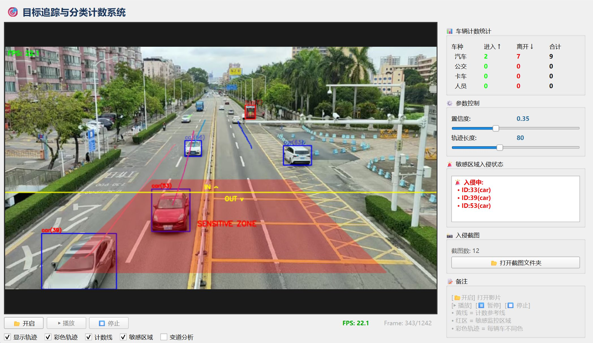
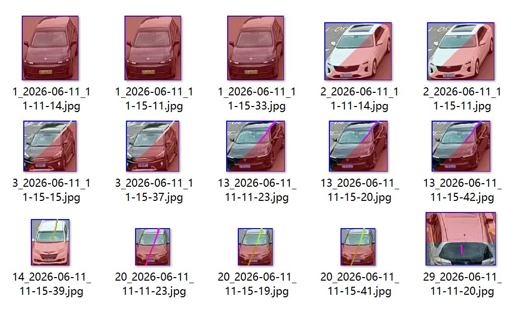

基于 Ultralytics YOLO 的实时目标追踪与交通监控系统，支持车辆分类计数、敏感区域入侵报警与变道检测，集成 PySide6 可视化控制界面。





## 功能

- 实时多目标追踪（车辆/行人）
- 分车型计数：car / bus / truck
- 虚拟越线统进入/出统计
- 敏感区域多边形入侵检测 + 自动截图保存
- 变道检测分析
- 彩色轨迹追踪绘制
- PySide6 GUI：播放/暂停/停止、参数调节、实时统计表

## 技术栈

Ultralytics YOLO · OpenCV · PySide6 · NumPy · PyTorch

## 快速开始

```bash
pip install ultralytics opencv-python PySide6 numpy torch
python gui_main.py
```
